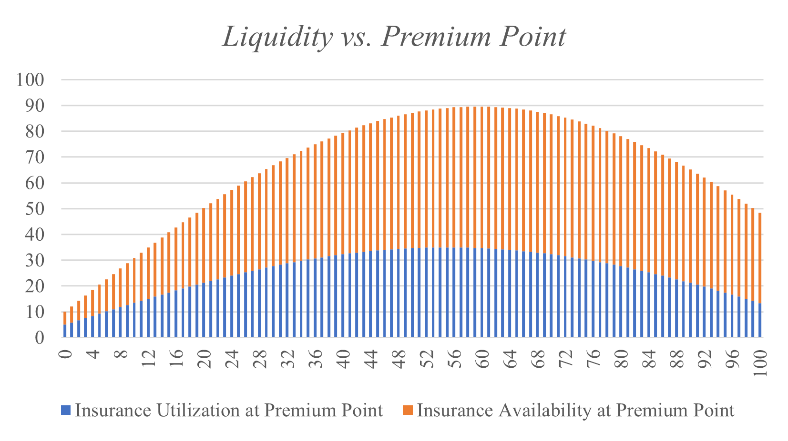

# Pricing & Purchasing

When underwriters deposit into the pool, they choose a **Price Point** at which they are willing to take on risk. The price point is the percentage of the total underwriting amount that a potential policyholder will pay when purchasing protection from the protocol. For example, if a user purchased 100 yDAI worth of protection at a price point of 5%, they would pay 5 yDAI upfront in premiums. Those premiums would be slowly dripped to the underwriters who had deposited at the five percent price point. Those premiums are denominated and paid in the credit token, not the underwriting token.

Potential policyholders observe the Price Points that are available and can buy at any Price Point with sufficient unutilized underwriting capital. If the Potential Policyholder wishes to purchase more protection that is available at one price point, he can split his order across multiple price points.

