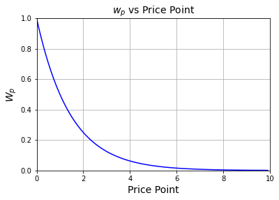

# Staking

Users can stake the claim tokens they receive from underwriting the Risk Harbor pool in exchange for non-transferable tickets \(tix\), which will eventually be redeemable for governance tokens. To incentivize underwriters to deposit at the lower price points so that more purchases occur, we scale tickets received according to the price point the underwriter deposited at. In particular, we use the following formula:

$$
R_{ib}= \tau_b \frac{\sum_{p \in \mathcal{P}} a_{ip}w_{p}}{\sum_{j =1}^n\sum_{p \in \mathcal{P}} a_{jp}w_{jp}}
$$

\*\*\*\*

Where$$R_{ib}$$are the returns for underwriter $$i$$ in block $$b$$, $$\tau_b$$ is the total ticket rewards allocated to stakers at block $$b$$, $$a_{ip}$$ is the amount that underwriter $$i$$ has staked at price point $$p$$, $$w_{ p} $$ is the weight associated with the price point $$p$$ and  $$\mathcal{P}$$ is the set of all supported price points.

The weights are given by:

$$
w_p = \frac{1}{2^p}
$$

Plotted Below

